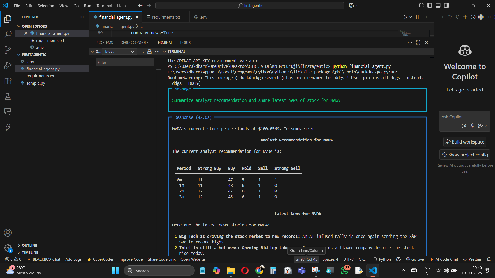
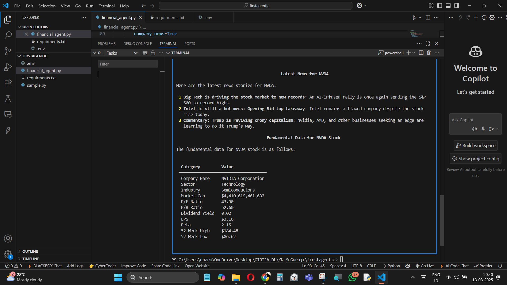
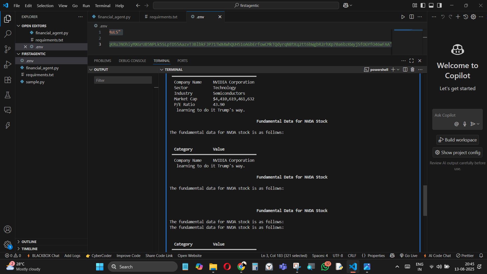
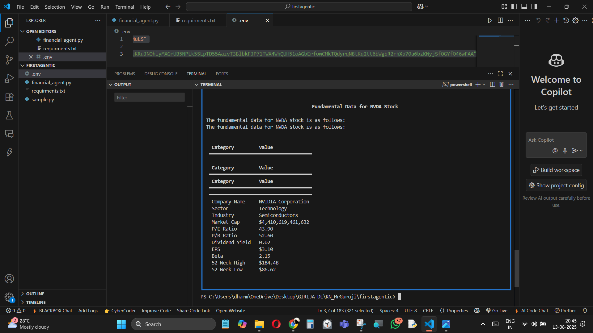

# Multi-Agent Stock Summary Bot (NVDA Example)

This project builds an **autonomous agent team** using [phidata](https://github.com/phidatahq/phidata) that:
1. Pulls **analyst recommendations + fundamentals + price** via Yahoo Finance  
2. Fetches **latest news** via DuckDuckGo search  
3. Combines and formats them neatly using Groq models.

---

## Output Screenshots

Here are four sample outputs from running the script:

<table>
  <tr>
    <td align="center">
      <b>📊 Analyst Recommendations</b><br>
      
    </td>
    <td align="center">
      <b>📰 Latest News</b><br>
      
    </td>
  </tr>
  <tr>
    <td align="center">
      <b>💹 Stock Fundamentals</b><br>
      
    </td>
    <td align="center">
      <b>📈 Price Chart</b><br>
      
    </td>
  </tr>
</table>

---

## How It Works
- **Agent 1:** Fetches stock data, analyst ratings, fundamentals, price chart.  
- **Agent 2:** Searches the web for the latest company news.  
- **Team Agent:** Combines both results into a single markdown response.

---

## Installation

```bash
git clone <your-repo-url>
cd firstagentic
pip install -r requirements.txt
